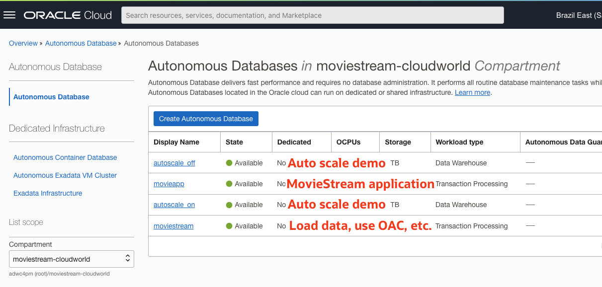

# Demo environment info

## Tenancy and compartment

* **Tenancy:** [adwc4pm](https://console.us-phoenix-1.oraclecloud.com/db/adb?region=sa-saopaulo-1)
* **Region:** Sao Paulo
* **Compartment:** moviestream-cloudworld

    

    **MOVIESTREAM database id/password**
    ADMIN / bigdataPM2019#
    MOVIESTREAM / cloudWorld2022#
    DEMO / cloudWorld2022#

## Useful links
* [ADB slides](https://oradocs-prodapp.cec.ocp.oraclecloud.com/documents/link/LDC8C6A771D11271F5DA16EEFAA1AABB4841F70E6F63/fileview/D51C39D2526566BE6EBD8B2F55B391D1C6AF0974FBF2/_ADB-Demobooth-Final.pptx)
* [Monitoring ADB slides (Nilay session)](https://oradocs-prodapp.cec.ocp.oraclecloud.com/documents/link/LDD0FC92C9FC83C48C16450D1F3349717F7350C39E90/fileview/D389C34112CECD1C14389CF612E7825A5EF49E79E929/_Final_-_How_to_Monitor_your_Database_-_Cloud_World.pptx)
* [MovieStream Application Demo](http://129.159.54.249/)
    
    Uses **movieapp** database (id/pwd: moviestream/cloudWorld123#)

* [Analytics Cloud](https://movieanalytics-adwc4pm-gr.analytics.ocp.oraclecloud.com/ui/)
