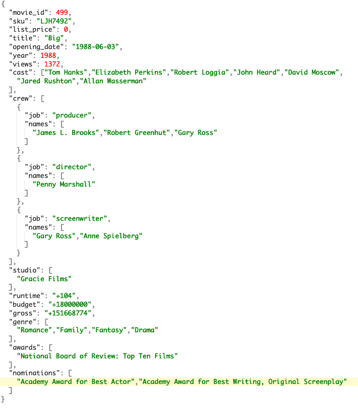

# Integrate all data

## Overview
Autonomous Database provides easy to use tools for integrating data into your database. See how to integrate different types of data from a variety of sources.

* [Go to LiveLabs](https://apexapps.oracle.com/pls/apex/r/dbpm/livelabs/view-workshop?wid=582&clear=RR,180&session=5232633923897)

## Load data from object stores
Autonomous Database can load data from multiple cloud stores - including OCI Object Storage, AWS S3, Azure Blob Storage and more. See how it's done.

**Try it!**

Use the demo user and load data:

* [Go to Database Actions](https://qggemtywectzfj9-db20220725133708.adb.sa-saopaulo-1.oraclecloudapps.com/ords/demo/_sdw/)
* Log in as demo / cloudWorld2022#

## Load data from local files

**Try it!**

Use the demo user and load data:

* [Download a sample customer demographics file](https://objectstorage.us-ashburn-1.oraclecloud.com/n/c4u04/b/moviestream_landing/o/customer_extension/customer-extension.csv)
* [Go to Database Actions](https://qggemtywectzfj9-db20220725133708.adb.sa-saopaulo-1.oraclecloudapps.com/ords/demo/_sdw/)
* Log in as demo / cloudWorld2022#

## Load JSON collections
### What is JSON?
JSON provides a language independent, flexible and powerful data model. It was derived from JavaScript, but many modern programming languages include code to generate and parse JSON-format data. For more information see here: [https://en.wikipedia.org/wiki/JSON](https://en.wikipedia.org/wiki/JSON). No wonder that it is such a popular storage format for developers.

Oracle SQL allows you to analyze JSON data - including complex data types like arrays - in combination with structured tabular data.

### Movie JSON data
Our movie data set has a series of columns that contain different types of details about movies. Each movie has a **crew** associated with it and that crew is comprised of **jobs**, such as "producer," "director," "writer," along with the names of the individuals. Each movie also has a list of award nominations and wins. An example of how this information is organized is shown below:

You can see that JSON data is organized very differently than typical warehouse data. There is a single entry for "producer" but the corresponding key "names" actually has multiple values. This is referred to as an **array** - specifically a JSON array.

Take a look at how Autonomous Database can load JSON, query complex JSON structures and combine that with other, more typical relational data:

**Try it!**

Use the demo user, load data and run queries:

* [Go to Database Actions](https://qggemtywectzfj9-db20220725133708.adb.sa-saopaulo-1.oraclecloudapps.com/ords/demo/_sdw/)
* Log in as demo / cloudWorld2022#
* Go to SQL worksheet and load the collection
* [See LiveLabs](https://oracle-livelabs.github.io/adb/shared/adb-load-analyze-workshop/workshops/ocw-freetier/index.html?lab=load-analyze-json) for the specific steps-by-step instructions

